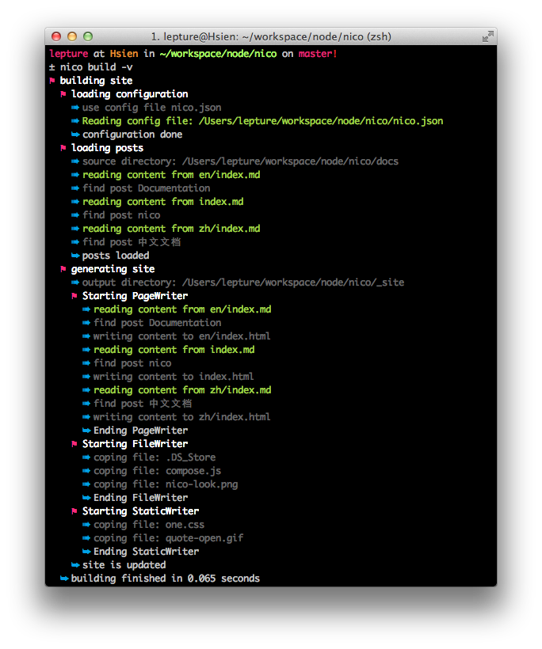

# nico

nico is a front-end friendly static site generator, best for web developers like you and me.

-----------

Ever want to build a static site? Don't fancy Python, Ruby or any other languages? Just like you, I do like javascript, and node made it so fun.

nico is written in javascript, using what you are familiar with makes you happy. You are able to change things, you are able to make a difference.


## How it Looks




## Documentation

Documentation is available in these languages:

- [English](./en/)
- [简体中文](./zh/)

Too long, don't read. But if you want to dive into it deeper, it will help you.


## Installation

nico is written in node which means you can easily install it with npm:

```
$ npm install nico -g
```

This will download and install the latest version of nico, remember the ``-g`` option.

## Quick Start

An example explains everything, since this site is built by nico, it's an example too.
Head over to [nico's github repo](https://github.com/lepture/nico) and find out the mistery.

### Configuration

The config file is [nico.json](https://github.com/lepture/nico/blob/master/nico.json) or nico.js. But you can use any name you want.

The only required part of configuration:

```javascript
{
    "source": "source directory, default is content",
    "output": "output directory, default is _site",
    "theme": "your theme path",
    "permalink": "permalink style",
    "writers": []
}
```

Actually the only required part is ``writers``, you can assign other information with command line:

```
$ nico build -I docs -O _site --theme=./_themes/one --permalink={{directory}}/{{filename}}.html
```


### Writing

There is a little difference between liquidluck and nico.

- nico only support markdown, and in the foreseen future, markdown will be the only choice.
- nico add more features for front-end developers.
- nico use meta status instead of meta public.

The overview of a post syntax:

    # This is title

    - pubdate: 2012-12-12
    - tags: javascript, python
    - meta-key: meta value

    This is the description, description is the part above ----

    ------------------

    Content is below the ----. We do support fenced code, but more than that.

    1. three ` (```) for the normal usage.
    2. four ` (````) will insert code to your page.
    3. five ` (````) will insert code to your page, but don't show the highlighted code.

    For example, with ````

    ````javascript
    var nico = true
    ````

    The result will be

    <script>
    var nico = true
    </script>
    <pre><code class="javascript">
    <span class="keyword">var</span> <span class="variable">nico ....
    </code></pre>


## Quality

The concept is borrowed from [liquidluck](http://lab.lepture.com/liquidluck/) with a little improvement. It should works like liquidluck, and it really did. I eat my own dog food, this site is built by nico.

The code of nico is well tested, and you can add more test case for this project.
Have a lookt at the [test coverage](./coverage) and find out the missing test case.


## Who are using nico

Me, of course. But besides that, the nice folks of our team are using nico too.

- The great project [arale](http://aralejs.com) is using nico heavily.


## Contributing

Contributing is really welcome, but before this you should read the [Contributing Guide](https://github.com/lepture/nico/blob/master/CONTRIBUTING.md).
